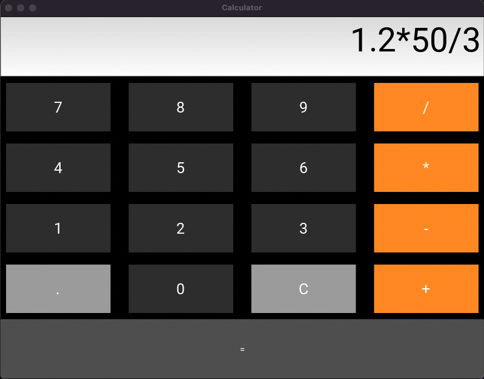

# Calculator App

This is a simple calculator application built with Kivy in Python. The application was developed following Test Driven Development (TDD) practices using a custom test suite with pytest.



## Features

- Basic mathematical operations like addition, subtraction, multiplication and division.
- Clean and user-friendly interface with comfortable button layout.
- Custom class for calculator functions, facilitating easy modification and expansion of features.
- Comprehensive tests with pytest to ensure accuracy and reliability of results.

## Prerequisites

Before you begin, ensure you have met the following requirements:

- You have installed Python 3.8 or higher.
- You have a Mac machine. This project has been tested on a Mac environment.

## Installing Calculator App

To install the Calculator App, follow these steps:

1. Clone the repository:

```bash
git clone https://github.com/yourusername/calculator-app.git
```

2. Change into the project directory:

```bash
cd calculator-app
```

3. Create and activate a virtual environment (optional but recommended):

```bash
python3 -m venv env
source env/bin/activate
```

4. Install the required packages:

```bash
pip install -r requirements.txt
```

## Using Calculator App

To use the Calculator App, follow these steps:

```bash
python3 src/main.py
```

## Running the Tests

To run the custom tests, use the following command:

```bash
pytest
```

## Contact

If you want to contact me, you can reach me at `vic.apaez@gmail.com`.

## License

This project uses the following license: `MIT`.
